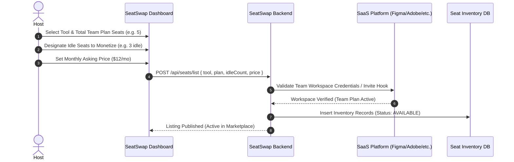
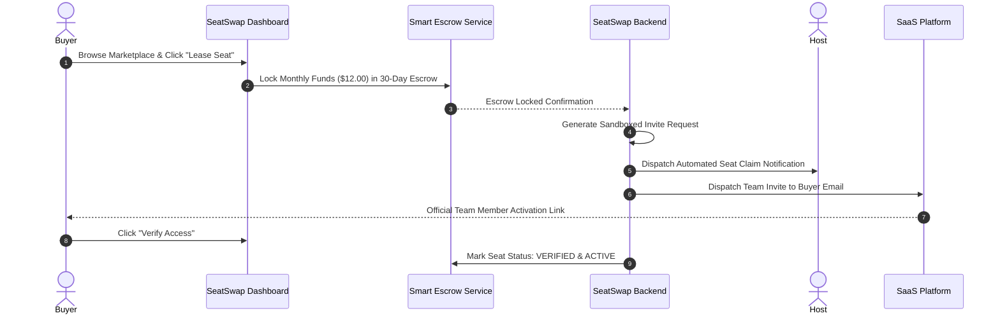
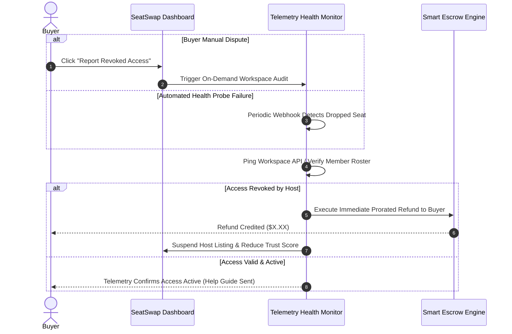

# SeatSwap™ Platform Architecture & Product Specification
**Document Version:** 2.0.0  
**Status:** Product vision and aspirational prototype specification; not a description of implemented functionality.
**Target Ecosystem:** Web (Desktop, Tablet, Apple Liquid Retina / Ultra-wide ProMotion Displays)  
**Core Domain:** P2P Micro-Leasing Marketplace for SaaS Team Plan Seats (Figma, Adobe CC, LeetCode, Midjourney, Canva, ChatGPT)

> **Implementation status:** The repository includes a static frontend, a Fastify/PostgreSQL account API, and auth UI wired to local account flows. Local PostgreSQL/Mailpit runtime verification is complete; staging and production are not configured. The catalog remains illustrative; no listings, escrow, payments, invite automation, or access monitoring exist. Some envisioned flows may be prohibited by provider terms or payment-partner policies. See [BACKEND_ARCHITECTURE.md](./BACKEND_ARCHITECTURE.md) for the grounded proposal and feasibility gates.

---

## 1. Executive Summary & Vision

### 1.1 The Unsolved Problem
Individual professional subscriptions for industry-standard creative, engineering, and artificial intelligence software have become prohibitively expensive:
- **Adobe Creative Cloud All Apps:** ~$60/month (~$720/year)
- **Figma Organization / Enterprise:** ~$45–$75/month per editor
- **LeetCode Premium:** ~$35/month (~$159/year)
- **Midjourney Pro:** ~$60/month (~$720/year)
- **ChatGPT Plus / Team:** ~$25–$30/month per seat
- **Canva Pro / Enterprise:** ~$15/month per seat

SaaS providers offer **Team and Enterprise plans that discount the per-seat price by 50% to 70%**. However, these discounts require purchasing seat bundles (e.g., minimum 5 or 10 seats). Individual freelance designers, independent software engineers, students, and early-stage founders:
1. Cannot justify the high cost of individual tier licenses.
2. Rarely have 4 friends or colleagues ready to split a team plan at the exact same calendar moment.
3. Resort to high-risk informal groups on WhatsApp, Discord, or Telegram, which frequently result in credential theft, scam payments, and abrupt access revocations without refunds.

### 1.2 The SeatSwap Solution
**SeatSwap™** is a decentralized, peer-to-peer micro-leasing marketplace for software subscription team seats.
- **The Host Flow:** A subscriber with a multi-seat team plan (e.g., 5-seat Figma Org or Adobe CC Team) lists their idle/unassigned seats on SeatSwap.
- **The Buyer Flow:** Individual users lease an isolated seat for **$3–$15/month**, saving 60%–75% over individual retail pricing.
- **Zero-Knowledge Security:** Buyers never see or use the host's primary password. Access is granted strictly via automated workspace email invite links (`user+seatswap@...`) or session-isolated OAuth proxy tokens.
- **Escrow Settlement:** Payments are locked in a rolling 30-day smart escrow. If a host revokes access or a workspace link breaks, the buyer receives an automated, prorated 100% refund.
- **Monetization:** SeatSwap charges a **flat 15% platform commission** on every monthly seat lease transaction.

---

## 2. Platform Architecture & Data Flow

```
+---------------------------------------------------------------------------------------+
|                                    SEATSWAP CLIENT                                    |
|   +---------------------------------------+   +-----------------------------------+   |
|   |         BUYER WORKSPACE               |   |          HOST WORKSPACE           |   |
|   | - Catalog & Live Liquidity Filter     |   | - Multi-Seat Team Plan Connector  |   |
|   | - 1-Click Escrow Lease Checkout       |   | - Idle Seat Inventory Manager     |   |
|   | - 3D Ergonomic Seat & Token Viewer    |   | - Invite Link Dispatcher          |   |
|   | - Access Validator & Dispute Trigger  |   | - Stripe Connect Payout Ledger    |   |
|   +-------------------+-------------------+   +-----------------+-----------------+   |
+-----------------------|-----------------------------------------|---------------------+
                        | HTTPS / WSS                             | HTTPS / WSS
+-----------------------v-----------------------------------------v---------------------+
|                              SEATSWAP API GATEWAY & WORKERS                           |
|                                                                                       |
|   +----------------------+   +-----------------------+   +------------------------+   |
|   |  Marketplace Engine  |   | Automated Invite Hub  |   |  Seat Health Monitor   |   |
|   |  - Catalog & Search  |   | - Magic Link Generator|   |  - API Telemetry Probe |   |
|   |  - 15% Fee Engine    |   | - OAuth Proxy Token   |   |  - Idle Seat Detection |   |
|   +----------+-----------+   +-----------+-----------+   +-----------+------------+   |
|              |                           |                           |                |
|   +----------v---------------------------v---------------------------v------------+   |
|   |                            SMART ESCROW LEDGER                                |   |
|   |   - 30-Day Rolling Escrow Lock                                                |   |
|   |   - 48-Hour Access Verification Window                                        |   |
|   |   - Automated Prorated Refund Engine on Revocation / Failure                  |   |
|   |   - Net Payouts (85% Host / 15% SeatSwap Commission) via Stripe Connect       |   |
|   +--------------------------------------+----------------------------------------+   |
+------------------------------------------|--------------------------------------------+
                                           |
+------------------------------------------v--------------------------------------------+
|                         EXTERNAL SAAS WORKSPACES & PROVIDERS                          |
|   +-------------------+  +-------------------+  +-------------------+  +----------+   |
|   |    Figma Teams    |  |     Adobe CC      |  | LeetCode Premium  |  |Midjourney|   |
|   |  (SCIM / Invites) |  |   (Admin Console) |  |  (OAuth Proxy)    |  | (Discord)|   |
|   +-------------------+  +-------------------+  +-------------------+  +----------+   |
+---------------------------------------------------------------------------------------+
```

---

## 3. Core Mechanics & Technical Specifications

### 3.1 Automated Access & Token Management (Zero-Knowledge Credentials)
To prevent account takeovers, credential harvesting, and violation of master account security:
1. **Automated Team Workspace Invites (Primary Mode):**
   - The host configures their workspace invite mechanism (e.g., Figma organization seat invite, Adobe Creative Cloud admin team member invite, Canva team invite).
   - Upon escrow lock, SeatSwap generates an encrypted dynamic alias for the buyer (e.g. `buyer.uuid@relay.seatswap.io` or direct work email).
   - The host's workspace dispatches an official workspace invite directly to the buyer's email.
   - The buyer joins the host's team as a discrete, sandboxed member. The buyer has zero access to the host's billing details, personal files, or master credentials.
2. **Session-Isolated OAuth Proxy (Secondary Mode for Tools without Email Invites):**
   - For platforms without native multi-seat email invites, SeatSwap provides an isolated headless OAuth session token broker.
   - The host grants a scoped seat session via an encrypted OAuth bridge.
   - The buyer authenticates through the SeatSwap browser proxy extension or web session launcher.
   - Master account passwords, payment cards, and security questions are completely masked and inaccessible.

### 3.2 Automated Seat Idle Detection & Health Telemetry
A critical vulnerability of informal seat sharing is "silent revocation" (a host removes the buyer after receiving payment). SeatSwap prevents this via continuous automated health probes:
1. **48-Hour Post-Lease Verification Window:**
   - Buyer must confirm seat access within 48 hours of lease initiation.
   - SeatSwap automated probe pings the tool's workspace status endpoint (or verifies invite acceptance telemetry).
   - If unconfirmed within 48 hours, the lease is voided and funds return 100% to the buyer.
2. **Heartbeat Health Probes (Every 12 Hours):**
   - SeatSwap background cron workers check seat validity via workspace member listing webhooks or verification pings.
   - If an active seat disappears from the host's team roster before the 30-day lease term concludes, a high-priority dispute is triggered automatically.

### 3.3 Financial Architecture: Smart Escrow & 15% Platform Commission
Every lease adheres to an immutable financial protocol:
1. **Lease Transaction Pricing Structure:**
   $$\text{Buyer Total} = P_{\text{seat}}$$
   $$\text{Platform Commission (15\%)} = 0.15 \times P_{\text{seat}}$$
   $$\text{Host Net Earnings (85\%)} = 0.85 \times P_{\text{seat}}$$
   *Example: Figma Enterprise Seat leased at $12.00/month:*
   - Buyer pays: **$12.00**
   - Held in 30-day Escrow: **$12.00**
   - Host receives at end of term: **$10.20**
   - SeatSwap platform fee: **$1.80 (15%)**
2. **Escrow Lifecycle:**
   - **T = 0:** Buyer initiates lease. Funds captured via Stripe / Payment Gateway into isolated Escrow Vault.
   - **T + 0 to 48 Hours:** Access Verification Window. Funds strictly locked.
   - **T + 48 Hours:** Verification milestone reached. Host receives confirmation; 85% scheduled for payout.
   - **T + 30 Days:** Term completes. Host receives automated payout via Stripe Connect. Lease automatically renews unless cancelled 48 hours prior.
3. **Dispute & Refund Guarantee:**
   - In the event of early revocation or downtime exceeding 24 hours, the smart escrow engine calculates a prorated refund:
     $$\text{Refund} = P_{\text{seat}} \times \frac{\text{Days Remaining}}{\text{Total Days}}$$
   - If host fails to deliver invite within 2 hours of checkout, buyer receives an instant 100% refund.

---

## 4. End-to-End User Workflows

### 4.1 Host Listing Workflow


### 4.2 Buyer Lease & Instant Escrow Workflow


### 4.3 Automated Dispute Resolution Workflow


---

## 5. Design System & Visual Identity

The SeatSwap web client adheres to an **editorial, high-density, cinematic aesthetic**:

### 5.1 Palette Tokens
- `--shade: #f2f0ec` — Warm parchment / studio chalk foundation (eliminates harsh sterile white).
- `--fg: #0d0c0b` — Deep editorial charcoal/ink for high-contrast legible typography.
- `--fg-soft: rgba(13,12,11,.66)` — Secondary metadata and explanatory text.
- `--fg-faint: rgba(13,12,11,.42)` — Telemetry indicators, timestamps, borders.
- `--rule: rgba(13,12,11,.14)` — Minimal hairline borders.
- `--kinetic-yellow: #ffbe0b` — Dynamic kinetic brand accent for active state highlights and escrow indicators.
- `--card-bg: rgba(255, 255, 255, 0.72)` — High-refraction frosted glass cards with `backdrop-filter: blur(20px)`.

### 5.2 Typography
- **Primary Typeface:** `Inter Tight` (weights 400, 500, 600, 700) — clean Swiss geometric sans with tight tracking (`letter-spacing: -0.025em`) for modern editorial elegance.
- **Monospace Code & Tokens:** `JetBrains Mono` / `SF Mono` for invite tokens, transaction hashes, and escrow balances.

### 5.3 3D Ergonomic Seat & Spatial Animation Stage
- Rather than generic geometries or abstract shapes, SeatSwap features an **interactive 3D Ergonomic Designer Seat (Aeron / Cosm style)** with an animated seated person/avatar, deployed across both the landing page (`index.html`) and the application dashboard (`dashboard.html`):
  - Procedural spine curvature, mesh seat pan, adjustable armrests, and 5-wheel star base.
  - Interactive avatar demonstrating posture states: *Deep Work Focus*, *Creative Recline*, and *Swivel Brainstorm*.
  - Holographic HUD overlays displaying real-time seat telemetry: Tool ID, Escrow Lock State, Zero-Credential Shield, and Uptime Guarantee.
  - 360° interactive Orbit / Turntable controls responding to mouse and touch drag gestures.
  - Dynamic tool skin lighting (Figma Purple, Adobe Crimson, LeetCode Gold, Midjourney Indigo, ChatGPT Emerald, Canva Cyan) coupled with real-time catalog item inspection.
  - Cinematic background animation system (ambient video stage, organic kinetic lighting canvas, luminous veil, and SVG fractal grain wash) shared identically across both pages.

---

## 6. Database Schema Specification

### 6.1 `users`
- `id`: UUID (Primary Key)
- `email`: String (Unique)
- `full_name`: String
- `role`: Enum (`buyer`, `host`, `dual`)
- `stripe_customer_id`: String
- `stripe_connect_id`: String (For host payouts)
- `trust_score`: Float (Initial: 5.0, range 1.0 - 5.0)
- `created_at`: Timestamp

### 6.2 `teams_hosted`
- `id`: UUID (Primary Key)
- `host_id`: UUID (FK -> `users.id`)
- `tool_name`: Enum (`figma`, `adobe_cc`, `leetcode`, `midjourney`, `canva`, `chatgpt`, `copilot`)
- `plan_tier`: String (e.g. `Organization`, `All Apps 100GB`, `Annual Team`)
- `total_seats`: Integer
- `idle_seats_count`: Integer
- `monthly_price_per_seat`: Decimal(10,2)
- `invite_method`: Enum (`email_invite`, `oauth_proxy`, `team_magic_link`)
- `invite_template_url`: String (Encrypted)
- `status`: Enum (`active`, `paused`, `depleted`)

### 6.3 `leases_escrow`
- `id`: UUID (Primary Key)
- `team_id`: UUID (FK -> `teams_hosted.id`)
- `buyer_id`: UUID (FK -> `users.id`)
- `host_id`: UUID (FK -> `users.id`)
- `monthly_fee`: Decimal(10,2)
- `platform_fee`: Decimal(10,2) (15%)
- `host_net_fee`: Decimal(10,2) (85%)
- `escrow_status`: Enum (`locked`, `verified_active`, `released_to_host`, `disputed`, `refunded`)
- `term_start`: Timestamp
- `term_end`: Timestamp
- `next_verification_ping`: Timestamp
- `created_at`: Timestamp

### 6.4 `audit_access_logs`
- `id`: UUID (Primary Key)
- `lease_id`: UUID (FK -> `leases_escrow.id`)
- `probe_type`: Enum (`48h_initial`, `periodic_12h`, `manual_dispute`)
- `status_code`: Integer
- `response_latency_ms`: Integer
- `is_healthy`: Boolean
- `details`: JSONB
- `timestamp`: Timestamp

---

## 7. Security, Privacy & Legal Guardrails

1. **Zero Exposure of Host Billing & Personal Files:**
   - Tool team structures strictly isolate each seat's personal drafts and billing settings.
   - For example, Figma Organization team members only see team projects designated by the admin; personal drafts remain private to the user.
2. **No Sharing of Master Passwords:**
   - Strictly enforced by SeatSwap policy and system architecture: any listing attempting to exchange raw email/password credentials is auto-flagged and rejected.
3. **Workspace Terms of Service Alignment:**
   - Team plan administrators are legally licensed to assign team seats to outside contractors, freelancers, and collaborators.
   - SeatSwap acts as an administrative escrow liaison matching project collaborators and micro-leasers.
4. **Instant Quarantine on Repeated Disputes:**
   - If a host receives two confirmed premature seat revocations, all their active listings are immediately paused, remaining escrow balances are refunded to buyers, and their account is barred from listing.
